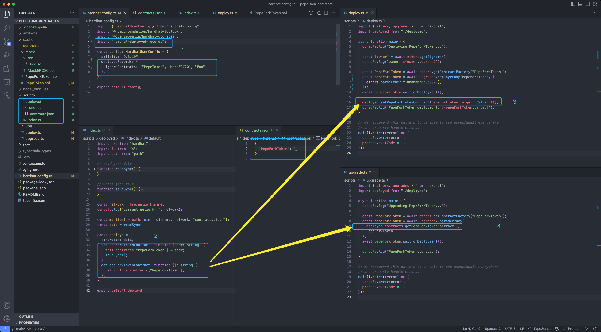

## Hardhat Deployed

Save deployed contract address.

#### 1. Install

```
$ npm install --save-dev hardhat-deployed
# or
$ yarn add --dev hardhat-deployed
```

#### 2. Included Commands

- `npx hardhat deployed init [--netwrok <network>]`: Initializes the deployed folder, `--netwrok` parameter is optional, default value is `hardhat` from Hardhat framework.Only needs to be executed once.
- `npx hardhat deployed add [--netwrok <network>]`: Generating new boring code for deploying to the new chain specified by `--netwrok` parameter.
- `npx hardhat deployed migrate`: Migrate the deployed folder, when contracts are rename、delete or add new contracts.
- `npx hardhat deployed list [--netwrok <network>]`: Listing contracts deployed address of the chain specified by `--netwrok` parameter.

Commonly, you need execute `npx hardhat deployed init [--netwrok <network>]` first and only once, and then:
- when you want to deploy contracts to a new network, you need to execute `npx hardhat deployed add --netwrok <network>`
- when you add new contracts or delete contracts you need to execute `npx hardhat deployed migrate` to keep deployed folder is the latest.

#### 3. Usage

Load plugin in Hardhat config:

```
require('hardhat-deployed');
# or
import 'hardhat-deployed';
```

Add configuration under `deployed` key:

| option            | description                                                       | optional | default            |
|-------------------|-------------------------------------------------------------------|----------|--------------------|
| `deployedDir`     | path to generated `deployed` directory (relative to Hardhat root) | true     | `scripts/deployed` |
| `ignoreContracts` | which contracts wants to ignore                                   | true     | `[]`               |

example:

```
deployed: {
    deployedDir: "scripts/deployed",
    ignoreContracts: ["MockERC20", "Foo"],
}
```

#### 4. The `scripts/deployed` directory's structure and how to use generated functions

when you execute `npx hardhat deployed init [--netwrok <network>]` task, it will generate default `scripts/deployed` directory(if you not set a different `deployedDir` value in `hardhat.config.ts` config file).

following is a `scripts/deployed` directory example:



so, in your deploy scripts, you can use `get<Foo>Contract(): string` function to get contract's address; and use `save<Foo>Contract(addr: string)` function to save contract's address.

#### 5. Version History

- v0.1.0 (2024/05/07)
  - init release
